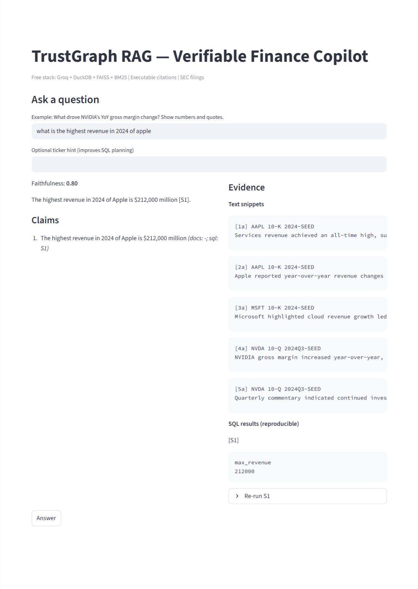

# TrustGraph RAG — Verifiable Finance Copilot (Free Stack)

Ask finance questions about public companies and get **verifiable answers** with **executable SQL citations**—grounded in SEC filings (10-K / 10-Q) **text + tables**.

**Stack:** Groq (LLM) · DuckDB (tables) · FAISS + BM25 (hybrid retrieval) · Sentence-Transformers (embeddings) · Streamlit (UI) · `uv` (env & runner)

---

## ✨ Why it stands out

* **Dual grounding**: retrieves both **filing text** and **numerical tables**, then ties claims to each.
* **Executable citations**: every numeric claim links to a **reproducible SQL** preview.
* **Faithfulness judge + abstain**: LLM-based verification; will **abstain** if evidence is weak.
* **Free tools only**: SEC data, DuckDB, FAISS, local HF models, Streamlit, Groq free tier.
* **Clean structure**: ingestion → indexing → retrieval (RRF + optional reranker) → generation → verification.
* **Tiny evaluation harness** for quick retrieval/generation checks.

---

## 📁 Project layout

```
trustgraph-finance-copilot/
├─ pyproject.toml
├─ .env.example
├─ README.md
├─ app.py                      # Streamlit UI
├─ data/                       # indexes, db, cache (seed or generated)
├─ src/trustgraph/
│  ├─ config.py
│  ├─ sec_ingest.py            # download + parse SEC filings (HTML → text + DuckDB tables)
│  ├─ sqlstore.py              # DuckDB helper
│  ├─ indexes.py               # build + query FAISS/BM25 (RRF, ticker-aware)
│  ├─ rrf.py
│  ├─ generation.py            # retrieval → SQL planning → answer with citations
│  ├─ verification.py          # faithfulness judge (robust JSON parsing)
│  └─ eval.py                  # small metric utils
└─ scripts/
   └─ rq_lab.py                # mini evaluation harness
```

---

## 🔧 Requirements

* **Python 3.10+**
* **uv** (package & environment manager)
  Install: `pip install uv` (or see uv docs)
* Internet (first run: HF models + Groq calls)

---

## ⚙️ Configure

1. Copy env file:

   ```bash
   cp .env.example .env
   ```
2. Edit `.env`:

   ```ini
   GROQ_API_KEY=your_groq_key_here

   # Required by sec-edgar-downloader (SEC User-Agent policy)
   SEC_COMPANY=TrustGraphRAG
   SEC_EMAIL=you@yourdomain.com

   # Optional overrides
   SEC_DOWNLOAD_DIR=./data/raw/sec
   DUCKDB_PATH=./data/sql/finance.duckdb
   EMBED_MODEL=intfloat/e5-base-v2
   RERANKER_MODEL=BAAI/bge-reranker-base
   GROQ_CHAT_MODEL=llama-3.3-70b-versatile
   ```

---

## 🚀 Quickstart (with the seed data)

> Use the seed to demo immediately (no SEC downloads needed).

1. Install deps:

```bash
uv sync
```

2. If your repo includes `data/sql/seed.sql`, create the DB (Windows/macOS/Linux):

```bash
uv run python -c "import duckdb, pathlib; p=pathlib.Path('data/sql/seed.sql'); con=duckdb.connect('data/sql/finance.duckdb'); con.execute(p.read_text()); con.close(); print('✅ DuckDB seeded')"
```

3. Build retrieval indexes:

```bash
uv run python -c "from src.trustgraph.indexes import build_indexes; build_indexes()"
```

4. Launch the app:

```bash
uv run streamlit run app.py
```

5. In the UI:

* (optional) **Ticker hint** → `AAPL`, `MSFT`, or `NVDA`
* Ask a question (see sample prompts below)

---

## 📥 Download actual SEC filings (optional)

From the sidebar you can ingest tickers. Or CLI:

```bash
uv run python -m src.trustgraph.sec_ingest --tickers AAPL MSFT NVDA --forms 10-K 10-Q --limit 1
uv run python -c "from src.trustgraph.indexes import build_indexes; build_indexes()"
```

> If you see `TypeError: Downloader.__init__() missing ... 'email_address'`, make sure **SEC_COMPANY** and **SEC_EMAIL** are set in `.env`, then restart.

---

## 💡 Using the app

* **Ingest SEC** → downloads & parses filings
* **Build Indexes** → creates FAISS (dense) + BM25 + fusion
* **Ask a question** → generation plans SQL, runs it, drafts an answer, and judges faithfulness
* **Evidence panel** → text snippets, SQL previews, and a “Re-run” expander to execute SQL yourself

> Retrieval is **ticker-aware**. Set **Ticker hint** to guide retrieval and SQL planning.

---

## 🧪 Sample prompts (seed-friendly)

**AAPL (Ticker hint: `AAPL`)**

* “Show **Apple 2024 revenue by segment** with **executable SQL citations**.”
* “Compute **YoY change** for **iPhone** revenue **2023→2024** (SQL + one exact quote).”
* “Which segment grew faster in 2024—**iPhone or Services**? Include SQL + a quote.”

**MSFT (Ticker hint: `MSFT`)**

* “Show **Microsoft segment revenue** for **2023 and 2024** (one SQL table).”
* “Which MSFT segment **contributed most to 2024 revenue**? Return a sorted SQL table.”

**NVDA (Ticker hint: `NVDA`)**

* “Show **Data Center revenue** across **2023Q3, 2024Q2, 2024Q3** (SQL) and summarize the trend.”

---

## 🧰 Evaluation harness

Run a tiny scripted evaluation:

```bash
uv run python scripts/rq_lab.py
```

---

## 🛠️ Troubleshooting


* **Faithfulness shows 0.00 / auto-abstain**

  * Rebuild indexes after edits
    `uv run python -c "from src.trustgraph.indexes import build_indexes; build_indexes()"`
  * Set **Ticker hint** in the UI
  * Ensure SQL results aren’t errors (seed DB created correctly)
  * The judge/parser is robust, but you can temporarily lower the threshold in `src/trustgraph/config.py` (`min_faithfulness`).

* **SEC downloader error (requires email)**
  Set `SEC_COMPANY` and `SEC_EMAIL` in `.env`, then restart.

---

## 🗺️ How it works (high level)

1. **Ingest** — Download 10-K/10-Q, parse HTML → clean text + extract tables → store tables in **DuckDB**; dump text chunks to `corpus.jsonl`.
2. **Index** — Build **FAISS** dense vectors (E5) using **metadata-aware encoding**, build **BM25**, then **RRF** fuse.
3. **Retrieve** — Hybrid retrieval (dense + lexical) with optional **ticker bias** + optional **cross-encoder rerank**.
4. **Generate** — Plan SQL against **real table names** (or synthesize safe fallback for common tasks), run SQL, draft answer with **[S#]** (SQL) and **[1a]** (text) footnotes.
5. **Verify** — LLM judge scores **faithfulness** (robust JSON parser) and the app **abstains** when evidence is weak.

---

## 🔐 Security & data

* Stores filings locally; no proprietary data.
* LLM calls go to **Groq** with your API key.
* This project is for demonstration/education.

---

## 📝 License

MIT

---

## 🙏 Acknowledgements

* SEC EDGAR team & **sec-edgar-downloader**
* **DuckDB**, **FAISS**, **Sentence-Transformers**
* **Streamlit**, **Groq**

---

## 📬 Contact

Issues / suggestions: open a GitHub issue in this repo.
